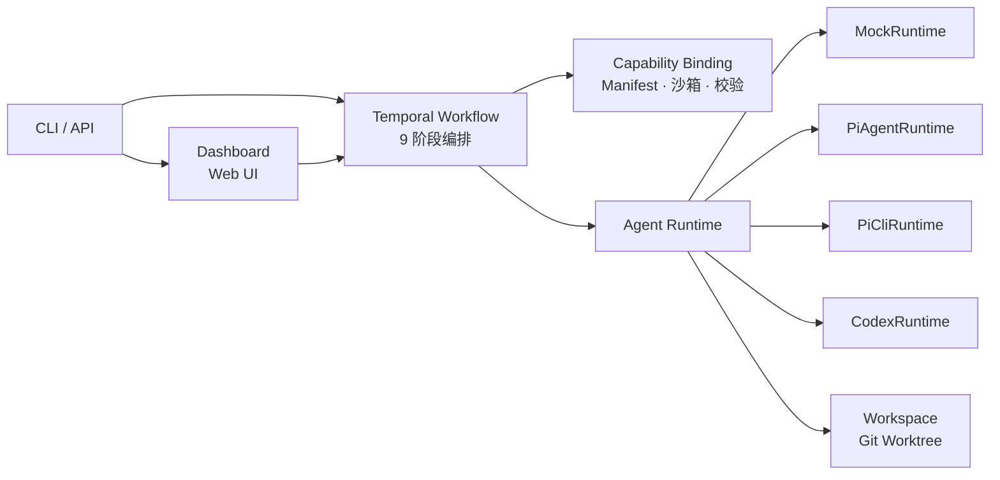

# Pi Agent Platform

基于 AI Agent 的长工程任务自动化平台 — 通过 Temporal 工作流编排需求分析、代码实现、测试验证和代码审查的完整软件开发闭环。

## 架构



## 技术栈

TypeScript 5.7 + Node.js 22 · pnpm · Temporal · Vitest · AJV · Commander · execa · Pi Agent SDK

## 目录

```
pi-agent-platform/
├── src/
│   ├── activities/       Temporal Activities（阶段执行、测试、工作区、报告）
│   ├── agent-runtimes/   Agent 运行时抽象（Mock / PiAgent / PiCLI / Codex）
│   ├── capability/       能力绑定（Manifest、沙箱、MCP、Skill、输出校验）
│   ├── cli/              CLI 命令（create-task / run-stage / run-mvp / workflow）
│   ├── dashboard/        本地 Web Dashboard（任务列表、事件流、审批）
│   ├── stages/           阶段执行器 + Prompt 组装
│   ├── testing/          测试命令解析 + 执行
│   ├── workflows/        Temporal 12 阶段工作流
│   ├── workspace/        Git Worktree 管理
│   └── __tests__/        19 个测试文件，93 个用例
├── prompts/              9 个阶段 Prompt 模板
├── schemas/              6 个 JSON Schema
├── skills/               Skill 文件
└── manifests/            9 个阶段 Manifest 配置
```

## 工作流阶段

| # | 阶段 | 沙箱级别 |
|---|------|---------|
| 1 | normalize_requirements | read-only |
| 2 | analyze_requirements | read-only |
| 3 | codegraph_impact | read-only (MCP) |
| 4 | write_implementation_plan | read-only |
| 5 | write_tests | workspace-write |
| 6 | implement_code | workspace-write |
| 7 | fix_test_failures | workspace-write（最多 3 轮） |
| 8 | review_diff | read-only |
| 9 | publish_final_report | read-only |

## 快速开始

```bash
cd pi-agent-platform
pnpm install
pnpm build
pnpm test                    # 运行测试
```

### 一键启动全栈环境

```bash
./init-env.sh                # 启动 Temporal Server + Worker + Dashboard
./init-env.sh --status       # 查看服务状态
./init-env.sh --stop         # 停止所有服务
```

启动后可用地址：

| 服务 | 地址 |
|------|------|
| Temporal Web UI | http://localhost:8233 |
| Dashboard | http://localhost:8787 |
| Temporal gRPC | localhost:7233 |

### CLI 运行

```bash
# Mock 端到端（无需真实 Agent，快速验证流程）
pnpm pi-agent-platform run-mvp --task TASK-001 --runtime mock

# 真实 Agent 执行（需要本机 pi 已安装并认证）
pnpm pi-agent-platform run-mvp --task TASK-001 --runtime pi --repo /path/to/repo \
  --wait-approval

# 单阶段运行（可单独执行任意阶段）
pnpm pi-agent-platform run-stage --task TASK-001 --stage normalize_requirements --runtime pi
pnpm pi-agent-platform run-stage --task TASK-001 --stage codegraph_impact --runtime pi
pnpm pi-agent-platform run-stage --task TASK-001 --stage implement_code --runtime pi
pnpm pi-agent-platform run-stage --task TASK-001 --stage review_diff --runtime pi
```

## 产物

任务产物在 `artifacts/tasks/<task-id>/`：`requirements.json`、`implementation-plan.json`、`codegraph-impact.json`、`test-result.json`、`diff.patch`、`final-report.md`、`events.jsonl`

## 状态

MVP 已完成：MockRuntime 全链路端到端闭环、Temporal 审批/重试、CLI 全套命令、本地 Web Dashboard。待完成：PiAgentRuntime 真实执行、Temporal 生产部署、GitHub PR 集成。