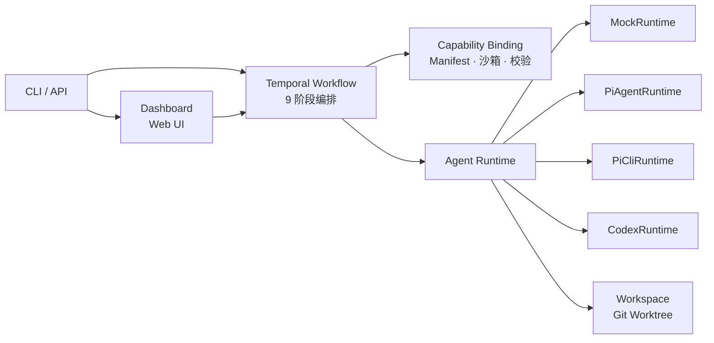

# Pi Agent Platform

基于 AI Agent 的长工程任务自动化平台 — 通过 Temporal 工作流编排需求分析、代码实现、测试验证和代码审查的完整软件开发闭环。

## 架构



### Dashboard

本地 Web 面板，提供任务全生命周期的可视化监控与人工审批：

- **任务列表** — 展示所有任务及其 Temporal 工作流状态
- **阶段进度** — 可视化 9 阶段执行进度，当前阶段高亮
- **实时日志流** — SSE 推送 workflow / agent / stderr 三类事件，支持按来源、阶段、级别过滤
- **人工审批** — 在浏览器中直接 Approve / Reject 需求评审和实现计划，通过 Temporal Signal 驱动工作流继续
- **产物查看** — 在线查看各阶段输出文件（requirements.json、diff.patch、final-report.md 等）
- **成本追踪** — Token 用量与成本汇总

启动：`pnpm pi-agent-platform dashboard --port 8787`，默认仅监听 127.0.0.1，无需前端构建工具链。

## 技术栈

TypeScript 5.7 + Node.js 22 · pnpm · Temporal · Vitest · AJV · Commander · execa · Pi Agent SDK

## 目录

```
pi-agent-platform/
├── src/
│   ├── activities/       Temporal Activities（阶段执行、测试、工作区、报告）
│   ├── agent-runtimes/   Agent 运行时抽象（Mock / PiAgent / PiCLI / Codex）
│   ├── capability/       能力绑定（Manifest、沙箱、MCP、Skill、输出校验）
│   ├── cli/              CLI 命令（create-task / run-stage / run-mvp / workflow）
│   ├── dashboard/        本地 Web Dashboard（任务列表、事件流、审批）
│   ├── stages/           阶段执行器 + Prompt 组装
│   ├── testing/          测试命令解析 + 执行
│   ├── workflows/        Temporal 12 阶段工作流
│   ├── workspace/        Git Worktree 管理
│   └── __tests__/        19 个测试文件，93 个用例
├── prompts/              9 个阶段 Prompt 模板
├── schemas/              6 个 JSON Schema
├── skills/               Skill 文件
└── manifests/            9 个阶段 Manifest 配置
```

## 工作流阶段

### 1. normalize_requirements — 需求标准化

| 属性 | 值 |
|------|-----|
| 能力 | 将自然语言需求转为结构化 JSON，补全缺失细节、消除歧义 |
| 沙箱 | read-only |
| 工具 | read_file, write_artifact |
| 入参 | `input.md`（用户原始需求） |
| 产物 | `requirements.json`（schema 校验）, `requirements.md` |
| 约束 | 最多 2 轮 Agent 运行，每轮 20 次工具调用 |

### 2. analyze_requirements — 需求分析

| 属性 | 值 |
|------|-----|
| 能力 | 分析需求可行性、识别风险点、拆解技术难点 |
| 沙箱 | read-only |
| 工具 | read_file, grep, find, ls, write_artifact |
| 入参 | `requirements.json`, `requirements.md` |
| 产物 | `requirement-analysis.md` |
| 约束 | 最多 2 轮 Agent 运行，每轮 20 次工具调用 |

### 3. codegraph_impact — 代码影响分析

| 属性 | 值 |
|------|-----|
| 能力 | 基于 CodeGraph 分析需求对代码库的影响范围，定位相关模块、函数、依赖 |
| 沙箱 | read-only（MCP 必须） |
| 工具 | read_file, write_artifact, codegraph_context, codegraph_explore, codegraph_impact |
| 入参 | `requirements.json`, `worktreePath`（代码仓库） |
| 产物 | `codegraph-impact.json`（schema 校验）, `codegraph-impact.md` |
| 约束 | 最多 2 轮 Agent 运行，每轮 40 次工具调用 |

### 4. write_implementation_plan — 实现计划

| 属性 | 值 |
|------|-----|
| 能力 | 基于需求和影响分析，制定分步骤实现计划，包含文件变更清单和依赖关系 |
| 沙箱 | read-only（MCP 必须） |
| 工具 | read_file, write_artifact, codegraph_context, codegraph_explore |
| 入参 | `requirements.json`, `codegraph-impact.json`, `worktreePath` |
| 产物 | `implementation-plan.json`（schema 校验）, `implementation-plan.md` |
| 约束 | 最多 2 轮 Agent 运行，每轮 30 次工具调用 |

### 5. write_tests — 编写测试

| 属性 | 值 |
|------|-----|
| 能力 | 按 TDD 流程先写测试用例，覆盖需求中的正常/边界/异常路径 |
| 沙箱 | workspace-write |
| 工具 | read_file, write_file, write_artifact, patch, terminal |
| 技能 | test-driven-development |
| 入参 | `requirements.json`, `codegraph-impact.json`, `implementation-plan.json`, `worktreePath` |
| 产物 | `test-cases.json`（schema 校验）, `test-cases.md`, `diff.patch` |
| 敏感操作 | install_dep, delete_file, modify_ci（需审批） |
| 约束 | 1 轮 Agent 运行，最多 80 次工具调用 |

### 6. implement_code — 代码实现

| 属性 | 值 |
|------|-----|
| 能力 | 按实现计划编写代码，操作 Git Worktree 隔离环境 |
| 沙箱 | workspace-write |
| 工具 | read_file, write_file, write_artifact, patch, terminal |
| 入参 | `requirements.json`, `codegraph-impact.json`, `implementation-plan.md`, `worktreePath` |
| 产物 | `implementation-notes.md`, `diff.patch` |
| 敏感操作 | install_dep, delete_file, modify_ci（需审批） |
| 约束 | 1 轮 Agent 运行，最多 120 次工具调用 |

### 7. fix_test_failures — 修复测试（最多 3 轮）

| 属性 | 值 |
|------|-----|
| 能力 | 分析测试失败原因，修复代码后重新运行测试，最多循环 3 次 |
| 沙箱 | workspace-write |
| 工具 | read_file, write_file, write_artifact, patch, terminal |
| 技能 | test-driven-development |
| 入参 | `test-result.json`, `test-output.log`, `implementation-plan.json`, `worktreePath`, `attempt`（第几轮）, `failedTests`（失败用例列表） |
| 产物 | `fix-attempt-{attempt}.md`, `diff.patch` |
| 敏感操作 | install_dep, delete_file, modify_ci（需审批） |
| 约束 | 每轮 1 次 Agent 运行，最多 80 次工具调用 |

### 8. review_diff — 代码审查

| 属性 | 值 |
|------|-----|
| 能力 | 审查 diff 变更：逻辑正确性、安全漏洞、代码风格、测试覆盖 |
| 沙箱 | read-only |
| 工具 | read_file, write_artifact, terminal |
| 技能 | requesting-code-review |
| 入参 | `diff.patch`, `requirements.json`, `implementation-plan.json`, `worktreePath` |
| 产物 | `review.md` |
| 约束 | 1 轮 Agent 运行，最多 40 次工具调用 |

### 9. publish_final_report — 最终报告

| 属性 | 值 |
|------|-----|
| 能力 | 汇总全流程产物，生成结构化最终报告（含需求、影响、实现、测试、审查结果） |
| 沙箱 | read-only |
| 工具 | read_file, write_artifact |
| 入参 | `requirements.json`, `codegraph-impact.json`, `implementation-plan.json`, `implementation-notes.md`, `test-result.json`, `review.md`, `diff.patch` |
| 产物 | `final-report.json`（schema 校验）, `final-report.md` |
| 约束 | 1 轮 Agent 运行，最多 20 次工具调用 |

## 快速开始

```bash
cd pi-agent-platform
pnpm install
pnpm build
pnpm test                    # 运行测试
```

### 一键启动全栈环境

```bash
./init-env.sh                # 启动 Temporal Server + Worker + Dashboard
./init-env.sh --status       # 查看服务状态
./init-env.sh --stop         # 停止所有服务
```

启动后可用地址：

| 服务 | 地址 |
|------|------|
| Temporal Web UI | http://localhost:8233 |
| Dashboard | http://localhost:8787 |
| Temporal gRPC | localhost:7233 |

### CLI 运行

```bash
# Mock 端到端（无需真实 Agent，快速验证流程）
pnpm pi-agent-platform run-mvp --task TASK-001 --runtime mock

# 真实 Agent 执行（需要本机 pi 已安装并认证）
pnpm pi-agent-platform run-mvp --task TASK-001 --runtime pi --repo /path/to/repo \
  --wait-approval

# 单阶段运行（可单独执行任意阶段）
pnpm pi-agent-platform run-stage --task TASK-001 --stage normalize_requirements --runtime pi
pnpm pi-agent-platform run-stage --task TASK-001 --stage codegraph_impact --runtime pi
pnpm pi-agent-platform run-stage --task TASK-001 --stage implement_code --runtime pi
pnpm pi-agent-platform run-stage --task TASK-001 --stage review_diff --runtime pi
```

## 产物

任务产物在 `artifacts/tasks/<task-id>/`：`requirements.json`、`implementation-plan.json`、`codegraph-impact.json`、`test-result.json`、`diff.patch`、`final-report.md`、`events.jsonl`

## 状态

MVP 已完成：MockRuntime 全链路端到端闭环、Temporal 审批/重试、CLI 全套命令、本地 Web Dashboard。待完成：PiAgentRuntime 真实执行、Temporal 生产部署、GitHub PR 集成。